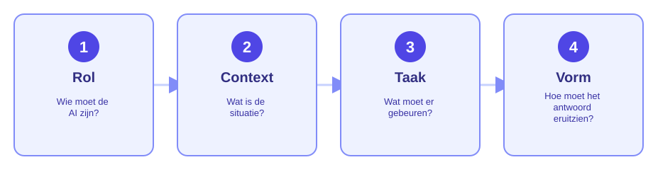

Je kent ChatGPT vast al. Deze les gaat niet over *of* je AI gebruikt, maar
over hoe je het slim, veilig en effectief inzet — straks als leidinggevende
op de bouwplaats, en nu al bij challenge 2.

Lees dit rustig door. De opdrachten die erop volgen bouwen hierop voort.

## 1. Wat bedoelen we met AI?

Met AI bedoelen we in deze les vooral **generatieve AI**: taalmodellen zoals
ChatGPT of Microsoft Copilot. Zulke modellen voorspellen telkens het meest
waarschijnlijke vervolg op tekst. Ze **begrijpen** niets in menselijke zin —
ze **genereren** een antwoord dat plausibel klinkt.

Voor jou als (toekomstig) uitvoerder of leidinggevende kan AI daarmee
helpen bij bijvoorbeeld:

- een eerste opzet maken van een planning, werkinstructie, e-mail of
  rapportage,
- een vakterm of norm in gewone taal laten uitleggen,
- ideeën of een checklist genereren voor bijvoorbeeld een toolbox,
- een tekst corrigeren of verduidelijken.

<x-callout type="tip">
AI is een <strong>hulpmiddel</strong>, geen vervanging van je eigen
vakkennis en verantwoordelijkheid. Hieronder lees je waarom dat zo
belangrijk is.
</x-callout>

## 2. Waarom AI niet altijd gelijk heeft

Omdat een taalmodel gokt op basis van patronen, in plaats van dingen zeker
te weten, gaat dat gokken niet altijd goed.

<x-callout type="warning">
AI kan met volledig zelfvertrouwen iets verzinnen dat er correct uitziet,
maar niet klopt. Dit heet een **hallucinatie**. De AI "liegt" niet bewust —
het heeft geen manier om te weten dat het fout zit.
</x-callout>

Een paar redenen waarom AI-antwoorden mis kunnen gaan, met voorbeelden uit
de bouw:

- **Verouderde informatie.** Het model kent alleen informatie tot een
  bepaalde datum. Een genoemde NEN-norm of Bouwbesluit-eis kan inmiddels
  gewijzigd zijn.
- **Verzonnen details.** Vraag je om een productspecificatie of
  fabrikantnaam en de AI kent het antwoord niet precies, dan verzint hij
  soms iets plausibels — inclusief niet-bestaande productcodes.
- **Geen lokale kennis.** De AI kent jouw project, bouwplaats of
  bedrijfsafspraken niet, tenzij jij die informatie zelf aanlevert.
- **Gemiddelde in plaats van feit.** Bij rekenvragen (bijv. een
  materiaalhoeveelheid) geeft de AI soms een aannemelijk klinkend getal dat
  niet klopt met jouw specifieke situatie.

## 3. Waarom je AI-antwoorden altijd controleert

Als toekomstig uitvoerder of leidinggevende neem jij de verantwoordelijkheid
voor wat je doorstuurt naar je team, opdrachtgever of onderaannemer — niet
de AI.

<x-compare>
<x-compare-item title="Zonder controle">

Je kopieert een door AI gegenereerde planning direct naar je team. Er blijkt
een verkeerde aanname over de droogtijd van beton in te zitten. Het team
plant de volgende fase te vroeg in.

</x-compare-item>
<x-compare-item title="Met controle">

Je gebruikt de AI-planning als startpunt, controleert de aannames (droogtijd,
weersafhankelijkheid, afstemming met andere disciplines) en past aan waar
nodig voordat je hem deelt.

</x-compare-item>
</x-compare>

**Vuistregel: AI is een startpunt, geen eindpunt.** Gebruik het om sneller
op gang te komen, niet om het laatste woord te hebben.

Dit geldt extra hard bij:

- **Planningen** — foutieve aannames leiden tot vertraging of onveilige
  volgordes van werk.
- **Werkinstructies** — een onduidelijke of onjuiste instructie kan tot
  fouten of onveilige situaties leiden.
- **Veiligheidsrapportages** — hier is controle niet optioneel: mensen
  kunnen letterlijk gewond raken als een risico verkeerd wordt ingeschat.

### Wat je niet in een AI-tool invoert

<x-callout type="danger">
Alles wat je in een publieke AI-tool typt, kan buiten jouw organisatie
terechtkomen of gebruikt worden om het model te verbeteren. Vertrouwelijke
of persoonsgebonden informatie hoort daar niet in.
</x-callout>

Deel dus geen:

- **Namen of persoonsgegevens van wie dan ook** — collega's, klanten,
  medewerkers of jezelf. Dit is de belangrijkste vuistregel: twijfel je, laat
  de naam dan gewoon weg. Dit geldt sowieso extra streng zodra het gecombineerd
  wordt met iets gevoeligs, zoals verzuim, functioneren of een BSN.
- Vertrouwelijke bedrijfsinformatie, zoals prijsafspraken, offertes of
  interne kostprijzen.
- Nog niet gepubliceerde tekeningen, BIM-modellen of ontwerpen zonder
  toestemming van de opdrachtgever.
- Informatie die concurrentiegevoelig is voor je opdrachtgever of bedrijf.

Twijfel je? Beschrijf de situatie algemeen (zonder namen, project- of
bedrijfsgegevens) in plaats van de originele documenten of gegevens te
kopiëren.

### Zet chatgeheugen ("memory") uit

Veel AI-chatbots, waaronder ChatGPT, hebben een geheugenfunctie die dingen
onthoudt uit eerdere, andere gesprekken. Handig voor persoonlijk gebruik,
maar niet altijd wenselijk bij schoolwerk of op de bouwplaats. Zet deze
functie uit (of start een nieuwe, "schone" chat) om twee redenen:

- **Betrouwbaarheid.** Je wilt bij elke opdracht een fris, onafhankelijk
  antwoord — niet een antwoord dat onbedoeld beïnvloed is door iets uit een
  oud, ongerelateerd gesprek.
- **Privacy.** Hoe minder een AI-tool onthoudt van wat je eerder hebt
  getypt, hoe kleiner het risico dat oudere, mogelijk gevoelige informatie
  ergens blijft rondzweven.

<x-callout type="tip">
Hoe je dit precies uitzet verschilt per tool en verandert regelmatig — kijk
bij twijfel in de instellingen (vaak onder "Privacy" of "Personalisatie") van
de AI-tool die je gebruikt.
</x-callout>

### Eerlijk vermelden dat je AI hebt gebruikt

Verantwoord AI-gebruik is niet alleen controleren — het is ook eerlijk zijn
over wat je hebt gedaan. Gebruik je AI als hulpmiddel bij een planning,
rapportage, werkinstructie of e-mail? Vermeld dat dan, volgens de afspraken
van je opleiding of werkgever.

<x-callout type="info">
AI gebruiken als hulpmiddel mag. Het ongecontroleerd overnemen van
AI-tekst en presenteren alsof het volledig je eigen werk is, niet — ook al
heb je er zelf niets aan veranderd.
</x-callout>

## 4. De vier bouwstenen van een goede prompt

Het gericht formuleren van een opdracht aan een AI heet **prompt
engineering**. Hoe duidelijker je context en doel, hoe beter en
voorspelbaarder het resultaat.

Een vage vraag levert een vaag antwoord op. Bouw je prompt op met deze vier
onderdelen en de kwaliteit van het antwoord gaat direct omhoog:

- **Rol** — wie moet de AI zijn? Bijvoorbeeld: *"Je bent een ervaren
  uitvoerder in de woningbouw."*
- **Context** — wat is de situatie? Project, fase, doelgroep, relevante
  omstandigheden.
- **Taak** — wat moet er precies gebeuren? Hoe concreter, hoe beter.
- **Vorm** — hoe moet het antwoord eruitzien? Lengte, toon, opmaak, taal.

<x-compare>
<x-compare-item title="Zwakke prompt">

"Schrijf een planning voor mijn bouwproject."

</x-compare-item>
<x-compare-item title="Sterke prompt (met de 4 bouwstenen)">

"Je bent een ervaren uitvoerder in de utiliteitsbouw. We lopen 3 dagen
vertraging op bij het storten van de begane grondvloer door regen. Stel een
bijgestelde weekplanning op voor de komende twee weken, waarin je rekening
houdt met de droogtijd van het beton en de aansluitende werkzaamheden van de
elektrapartij. Presenteer het antwoord als een overzichtelijke tabel per
dag, in het Nederlands."

</x-compare-item>
</x-compare>

Het verschil zit 'm niet in "slimmer typen" — het zit in **volledigheid**.
Hoe meer relevante informatie je meegeeft, hoe minder de AI hoeft te
gokken.

<x-callout type="tip">
Niet tevreden met het antwoord? Voeg ontbrekende context toe of stel een
vervolgvraag. Een prompt hoeft niet in één keer perfect te zijn.
</x-callout>

## 5. Werken in duo's: opsteller en controleur

Bij de opdrachten waarin je zelf een prompt schrijft, werk je met vaste
rollen — dat maakt "controle" (zie onderdeel 3) iets wat je samen echt
oefent, niet iets wat je alleen leest:

- **Opsteller** — schrijft de prompt en werkt met de AI.
- **Controleur** — leest actief mee en bewaakt de kwaliteit: klopt dit,
  mist er iets, is dit veilig om te delen?

Wissel na elke opdracht van rol. Geef elkaar daarna kort **tips & tops**:
één ding dat goed ging in de prompt of de controle, en één ding dat
scherper had gekund.

Ga hierna aan de slag met de opdrachten — die bouwen alle onderdelen
hierboven stap voor stap in de praktijk.
